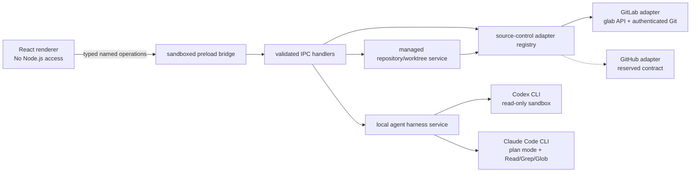

# ReviewFlow desktop architecture

ReviewFlow is a macOS review client with two deliberate boundaries:

1. hosted source-control systems are normalized behind a source-control adapter;
2. local coding agents are invoked only in the Electron main process through named, read-only review operations.

The existing static GitLab web app remains available. Electron loads the same exported renderer, but exposes a narrowly scoped bridge that causes `HomeContent` to select the desktop experience.

## Dependency direction

The renderer cannot choose an executable, working directory, command-line argument list, source-control endpoint, or shell command. It can request only the operations defined in `ReviewFlowDesktopApi`.

## Provider-neutral review model

`desktop/contracts.ts` defines the data consumed by the dashboard and guided review:

- `DesktopReview` represents a proposed code change regardless of whether a provider calls it a merge request or pull request.
- `ReviewRef` is a discriminated union. GitLab uses project ID plus IID; the reserved GitHub member uses owner, repository, and pull-request number.
- `RepositorySummary`, people, readiness, branches, SHAs, labels, and URLs contain no GitLab response types.
- `ReviewSource` adds the exact base/head SHAs and provider remote refs required by the local Git layer.

Provider-specific API payloads do not cross the adapter boundary or reach React components.

## Source-control adapter contract

`SourceControlAdapter` owns all provider-specific operations:

- report CLI availability;
- list normalized reviews for a dashboard queue;
- resolve one review to exact repository metadata and refs;
- clone using the provider CLI's existing authentication and configured Git protocol;
- fetch the exact provider refs with provider-managed Git credentials.

`SourceControlRegistry` is the only provider lookup used by IPC and worktree services. GitLab is registered today. GitHub appears in settings as an intentionally unavailable adapter so the product seam stays visible without presenting an unfinished connection as usable.

The worktree service does not contain GitLab ref syntax. It asks the selected adapter to clone/fetch, verifies the returned base and head commits exactly, then performs provider-independent local Git operations.

### Adding GitHub

A GitHub implementation should be isolated to a `GitHubAdapter` and its contract tests:

1. Use the authenticated `gh` CLI for status, GraphQL/REST dashboard queries, cloning, and Git credentials.
2. Map GitHub users, repositories, pull requests, checks, review-request state, base/head SHAs, and readiness into the existing contracts.
3. Return GitHub's target branch ref and pull-request head ref from `getReviewSource`.
4. Implement `cloneRepository` with `gh repo clone` and `fetchReviewRefs` with the `gh auth git-credential` helper.
5. Register the adapter in `desktop/main.ts` and mark it implemented through the existing registry behavior.
6. Add fixture-driven mapping tests and run the same exact-ref worktree integration suite against the adapter contract.

The dashboard, filters, persistence, walkthrough, automated findings, Q&A, and diff UI should not require provider branches when this adapter is added. Provider-specific copy should come from adapter metadata rather than new conditionals in the review workflow.

## Managed repositories and worktrees

ReviewFlow stores its own repositories beneath Electron's application data directory. It never discovers, switches, resets, or edits a user's existing checkout.

- One cached repository is scoped by provider, hostname, and remote repository identity.
- The cached `origin` must still match one of the provider's advertised clone URLs; URLs containing credentials are rejected.
- Fetches write only namespaced `refs/reviewflow/*` refs.
- Each review head gets a detached, SHA-versioned worktree.
- Existing directories or unexpected commits are never overwritten.
- The local diff and renderer payload are bounded, while agents can inspect the checked-out repository with read-only tools for wider context.

Old SHA worktrees are retained in this MVP. A later cleanup feature should enumerate only ReviewFlow-owned paths, show reclaimed size, and require an explicit retention policy.

## Agent boundary

Codex and Claude Code authentication remains owned by their CLIs. ReviewFlow never receives a subscription credential.

Every operation is constructed by the main process from a fixed template and JSON schema:

- walkthrough generation groups changed files into review concepts;
- automated review returns private, evidence-backed candidate findings;
- Q&A answers a bounded human question with repository evidence and caveats.

Repository content, diff text, titles, descriptions, branch names, and questions are explicitly marked as untrusted evidence. Codex runs with a read-only sandbox and approvals disabled. Claude Code runs in plan mode with only `Read`, `Grep`, and `Glob`. Neither adapter receives write tools, and nothing can post a comment, approve, merge, or edit code in this MVP.

## Persistence and privacy

- Desktop connection choices live in a mode-`0600` JSON file in Electron's user-data directory.
- Repository caches, detached worktrees, and generated JSON schemas live beneath the same app-owned directory.
- Review notes, progress, saved outlines, candidate findings, and recents use the renderer's local storage and are keyed by provider-specific `ReviewRef` identity.
- Provider and agent tokens remain in their CLIs. No credential is exposed through preload or persisted by ReviewFlow.
- External navigation is restricted to normal HTTP/HTTPS URLs; local content is served from the fixed `reviewflow://app` host with a content security policy.

## Deliberate MVP limits

- GitLab is the only implemented source-control adapter.
- Codex and Claude Code are the implemented harnesses.
- The build is unsigned and not notarized.
- ReviewFlow does not post comments, submit a review, approve, merge, edit code, or run repository commands supplied by the renderer.
- Worktree cleanup and disk-usage management are future product work.
